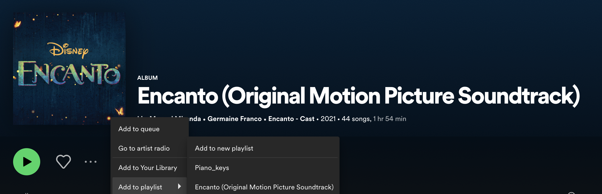

Hello, my name is Paula and I'm originally from Colombia. 
I felt incredibly proud about my Country a couple of weeks ago when Encanto movie won the **Best Animated Feature film at 2022 Oscars**.

Encanto is the first animated movie featuring Colombia and its vibrant music styles and rythms at its core, and after having some tears of joy, I felt inspired to do some analysis and visualizations about the movie's soundtrack. 

You can explore my [Encanto's soundtrack visualization here](https://public.tableau.com/app/profile/paula.munoz/viz/Encanto-SoundtrackAnalysis/Encanto)

Below I will describe the steps taken and tools used during my analysis.

### Data and Tools used

* Data:   Spotify - Encanto's soundtrack playlist
* spotifyr: R wrapper to pull track audio features from Spotify's API
* R Studio: For data wrangling
* Tableau Desktop: To build data visualization
* Tableau Public: To publish visualization


### Steps

1. Add Encanto's soundtrack to your Spotify Playlist / Library.


    
2. To be able to access Spotify's Data, you need to request a developer's account here: <https://developer.spotify.com/dashboard/>
    * Create and APP, and fill out the required information
    * A **Client ID** and **Client Secret** will be provided, and once you have those you can pull your access token which will be used in next step
{} 
Go to **Edit Settings** and set **Redirect URIs** to http://localhost:1410/ 
{}
    
    
    

    
3. Open R studio > new file > R script 

    * Install and load required libraries:
```{r}
install.packages("spotifyr")
install.packages("tidyverse")

library(spotifyr)
library(tidyverse)
```

   * To authenticate set your credentials to the System Environment variables **SPOTIFY_CLIENT_ID** and **SPOTIFY_CLIENT_SECRET**. 
   * Get access token with **get_spotify_access_token()**  
    

```{r}
id      <- 'xxxxxxxxxxxxxxxxxxxxxxxxxxx'
secret  <- 'xxxxxxxxxxxxxxxxxxxxxxxxxxxxxxxx'
Sys.setenv(SPOTIFY_CLIENT_ID = id)
Sys.setenv(SPOTIFY_CLIENT_SECRET = secret)
access_token <- get_spotify_access_token()
```

4. Get your Spotify's playlist:

```{r}
my_playlists <- get_my_playlists()

my_playlists %>% 
  select(name)
```


5. Get Encanto's Palylist ID:
```{r}

encanto_playlist <- my_playlists %>%
    filter(name %in% c('Encanto (Original Motion Picture Soundtrack)')) %>%
    select(id, name)

encanto_playlist
```


6. Get track information from Encanto's playlist

```{r}
encanto_tracks <- get_playlist_tracks(encanto_playlist$id) 

encanto_tracks
```

7. Get features from tracks
```{r}
encanto_tracks_feat <- get_track_audio_features(encanto_tracks$track.id)

encanto_tracks_feat
```


8. Select relevant columns
```{r}
encanto_tracks_feat_clean <-encanto_tracks_feat %>%
    select(danceability, energy, key, loudness, mode, speechiness, acousticness, 
    instrumentalness, liveness, valence, tempo, id, duration_ms )

encanto_tracks_feat_clean
```

9. Get Artist Audio Features (This would show favorite Key/ Scale used)
```{r}
encanto_audio_feat <-  get_artist_audio_features('encanto')
encanto_audio_feat

encanto_audio_feat_clean <- encanto_audio_feat %>%
    select(artist_name, artist_id, track_id, track_name, key_name,
    mode_name, key_mode ) %>%
    arrange(track_name) 

encanto_audio_feat_clean
```


10. Join track features dataframe with author audio features dataframe
```{r}

encanto_soundtrack_df <- encanto_tracks %>%
    left_join(encanto_tracks_feat_clean, by = c('track.id' = 'id')) %>%
    left_join(encanto_audio_feat_clean, by = c('track.id' = 'track_id'))

encanto_soundtrack_df
```

11. Output file to .csv
```{r}

encanto_soundtrack_df  %>%
    write_csv("../encanto_soundtrack.csv")
```

At this point we can import the data into Tableau Desktop and start building our visualization.

My visualization was designed to provide interactivity to the end user, and I used a combination of 

* Filter Actions
* Highlight Actions
* Parameter Actions
* URL Actions
* Add show / Hide Button
* Also used and advanced chart: Coxcomb Chart - [Thanks to the Flerlage Twins for sharing their template and blog.](https://www.flerlagetwins.com/2021/12/coxcomb.html)


You can explore my [Encanto's soundtrack visualization here](https://public.tableau.com/app/profile/paula.munoz/viz/Encanto-SoundtrackAnalysis/Encanto)

### Did you find this blog helpful? Consider sharing it 🙌
